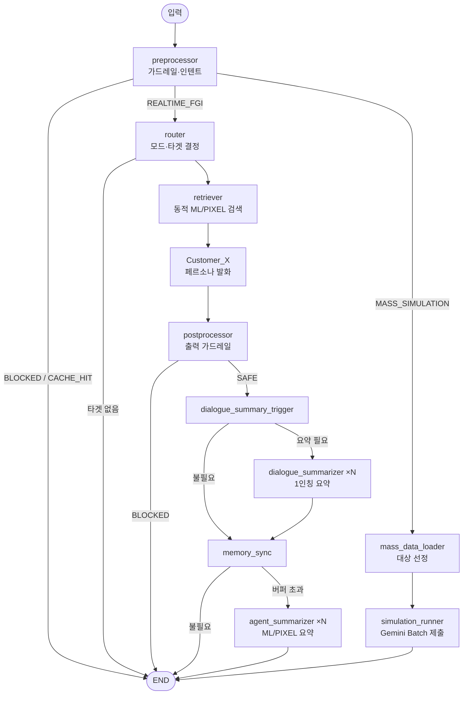

# AI Clone — 페르소나 기반 FGI 시뮬레이션 엔진

고객 데이터(마인드셋·구매이력·마이크로 특성)로 **가상 고객 페르소나(AI 클론)** 를 만들고,
이들을 대상으로 **FGI(표적집단심층면접, Focus Group Interview)** 를 실시간 대화로 진행하거나
**수만 명 규모의 대량 반응 시뮬레이션**을 배치로 돌리는 시스템입니다.

LangGraph 기반의 멀티 에이전트 그래프 위에 입·출력 가드레일, 시맨틱 캐시, 동적 RAG 검색,
계층적 메모리 요약을 얹어 구성했습니다.

---

## 핵심 개념

| 약어 | 의미 | 설명 |
|------|------|------|
| **MS** | Mindset | 고객의 핵심 마인드셋(가치관·성향). 페르소나의 정체성. |
| **ML** | Transaction History | 구매/거래 이력. |
| **PIXEL** | Micro-Attributes | 고객의 미세 행동·특성 속성. |
| **PROMO** | Promotion | 평가 대상 캠페인/상품 정보. |
| **클론** | Persona Agent | 위 데이터로 빚어진 1명의 가상 고객(`Customer_A`, `Customer_B` …). |

각 클론은 자기 MS를 정체성으로 삼고, 질문과 관련된 ML/PIXEL을 **동적으로 검색(RAG)** 해
맥락에 맞춰 1인칭으로 발화합니다.

---

## 주요 기능

- **멀티 에이전트 FGI (4가지 진행 모드)**
  - `@ALL` / `@모두` — 전체 순차 발언
  - `@A` 또는 `A` — 특정 클론 1:1 집중
  - `@FREE_TALK` — 클론끼리 자유 토론
  - 빈 입력(엔터) — 침묵 시 다음/지목 클론에게 자동 진행
- **입력 가드레일** — 프롬프트 인젝션 탐지로 위험 입력 차단
- **출력 가드레일** — 독성/유해/PII/금칙어 검열, 위험 발화는 경고로 덮어쓰기
- **시맨틱 캐시(Redis)** — 클론(persona_id)별로 유사 질문 응답 재사용
- **동적 장기기억 RAG** — 질문마다 관련 ML/PIXEL을 임베딩 검색해 주입
- **계층적 메모리 요약** — 대화가 길어지면 1인칭 주관 요약으로 압축, ML/PIXEL은 Map-Reduce 병렬 요약
- **대량 시뮬레이션** — Gemini Batch API로 수만 건 반응을 비동기 제출, 룰+LLM 심판으로 결과 검증

---

## 아키텍처 (LangGraph 흐름)



> 대량 시뮬레이션 그래프는 **Batch Job 제출까지만** 담당합니다. 배치는 수십 분이 걸릴 수
> 있어, 폴링·검증·캠페인 메타 추출은 **그래프 밖**(동기 `BatchResultValidator`)에서 별도로
> 처리하도록 의도적으로 분리했습니다. (아래 [대량 시뮬레이션](#대량-시뮬레이션-batch) 참고)

---

## 프로젝트 구조

```
ai_clone_dev/
├─ async_core/                  # 비동기 코어
│  ├─ FGIGraphAsync.py          # ★ build_fgi_graph + 라우팅 + 실행 루프 (그래프 진입점)
│  ├─ FGIBootstrap.py           # ★ Colab 부트스트랩 (assemble_fgi / main)
│  ├─ FGIState.py               # 그래프 State + 메모리 리듀서
│  ├─ FGINodesAsync.py          # preprocessor/router/retriever/customer/postprocessor 노드
│  ├─ FGISummaryNodesAsync.py   # 대화/ML/PIXEL 요약 노드
│  ├─ MassSimulationNodesAsync.py # 대량 시뮬레이션 노드
│  ├─ ContextManagerAsync.py    # Jinja2 프롬프트 렌더링
│  ├─ InputPreprocessorAsync.py # 입력 가드레일 + 시맨틱 캐시
│  ├─ OutputPostprocessorAsync.py # 출력 가드레일
│  ├─ SimulationEngineAsync.py  # Gemini Batch 렌더링/제출
│  ├─ BatchResultValidatorAsync.py # 배치 결과 폴링/검증 (그래프 밖)
│  ├─ PersonaAgentAsync.py      # (레거시) 클래스 기반 단일 에이전트
│  ├─ HybridMemoryManagerAsync.py # (레거시) 메모리 매니저
│  └─ MultiAgentOrchestratorAsync.py # (레거시) LangGraph 이전 오케스트레이터
├─ sync_core/                   # 위 모듈들의 동기 버전 + DataLoader
│  └─ DataLoader.py             # 프로모션/고객 데이터 로딩·검색·프로필 생성
├─ common/
│  ├─ schemas.py                # Pydantic 입출력 스키마
│  ├─ paths.py                  # 프롬프트 템플릿 경로 상수
│  ├─ utils.py                  # debug_node, clean_json_string
│  └─ Prompts/                  # *.md 프롬프트 템플릿
└─ llm.md                       # 모듈 의존성/아키텍처 상세 맵
```

> 📌 `*Async`(LangGraph) 경로가 현재 메인입니다. `sync_core/`와 레거시 클래스
> (`MultiAgentOrchestratorAsync`, `PersonaAgentAsync`)는 이전 구조로 보존되어 있습니다.

---

## 데이터 파이프라인

```
parquet (MS table, ML table) ─┐
                              ├─ DataLoader
df_pd_de_tot, df_pixel ───────┘   ├─ find_relevant_ms_faiss()  # FAISS: 프로모션 ↔ MS
                                  ├─ find_relevant_ml()        # BM25: 프로모션 ↔ 상품이력
                                  ├─ get_fgi_profile()         # 단일 클론 프로필 (+임베딩)
                                  └─ get_mass_simulation_df()  # 대량 시뮬 대상 DF
```

⚠️ `build_fgi_graph` 호출 **전에** 반드시 `find_relevant_ms_faiss()` + `find_relevant_ml()`
이 선행돼야 합니다(안 하면 `get_fgi_profile`이 `ValueError`). `FGIBootstrap.assemble_fgi`가
이 순서를 책임집니다.

---

## 사전 요구사항

- **Python 3.11+**
- **GCP**: Vertex AI(Gemini) + Cloud Storage 버킷 (대량 시뮬레이션용)
- **Redis**: 시맨틱 캐시용 (없어도 graceful degradation — 캐시만 비활성)
- **데이터**: MS/ML parquet 테이블, 거래상세·픽셀 DataFrame
- **주요 라이브러리**
  ```
  langgraph  langchain-core  pydantic  polars  numpy
  sentence-transformers  transformers  torch
  redis  faiss  bm25s  kiwipiepy  jinja2
  google-genai  google-cloud-storage
  ```
- **로컬 모델** (가드레일/임베딩): 프롬프트 인젝션 분류기, 독성 분류기, safe 판정 LM,
  PII NER, 문장 임베더

---

## 실행 방법 (Colab)

Colab에는 이미 무거운 객체(임베더·LLM·가드레일 래퍼·DataFrame)가 로드돼 있다고 가정하고,
`FGIBootstrap`이 나머지 조립과 사전작업을 처리합니다.

```python
from async_core.FGIBootstrap import main

# Colab은 이벤트 루프가 떠 있으므로 asyncio.run()이 아니라 await로 호출
await main(
    embedder_model=embedder,                 # SentenceTransformer
    main_llm=llm, summary_llm=summary_llm,    # LangChain 챗모델 (Vertex AI)
    inputpreprocessor=inputpreprocessor,      # 이미 만든 InputPreprocessorAsync
    outputpostprocessor=outputpostprocessor,  # 이미 만든 OutputPostprocessorAsync
    df_pd_de_tot=df_pd_de_tot, df_pixel=df_pixel,
    ms_table_path="...ms.parquet", ml_table_path="...ml.parquet",
    promo_item="귀리 음료", promo_info="...캠페인 전문...",
    srg_keys=["key1", "key2", "key3"],        # 클론으로 만들 고객 키
    gcp_project="my-project", gcp_location="us-central1",
    bucket_name="my-bucket",
    debug=True,
)
```

실행되면 진행자(당신) 프롬프트가 뜨고, 위 4가지 모드 문법으로 FGI를 진행합니다
(`quit`/`exit`로 종료).

### 대량 시뮬레이션 (Batch)

입력에 `@SIMULATE`(또는 `@MASS`/`@시뮬레이션`)를 포함하면 대량 시뮬레이션 분기로 빠져
Gemini Batch Job을 제출합니다. **결과 수집·검증은 그래프 밖에서** 별도로 실행합니다:

```python
from sync_core.BatchResultValidator import BatchResultValidator, PromotionMeta

# 1) 캠페인 메타(가격·앵커) 추출
meta = PromotionMeta.extract(client=genai_client, context_manager=ctx,
                             tmpl_path=campaign_tmpl, promo_info=promo_info)

# 2) 폴링 + 수집 + 검증
validator = BatchResultValidator(genai_client, storage_client, bucket_name,
                                 context_manager=ctx,
                                 judge_sys_tmpl_path=..., judge_user_tmpl_path=...)
valid_df, fmt_err_df = validator.poll_and_ingest(job_name, job_id)
final_df, logic_err_df = validator.validate_all(valid_df, meta)
print(f"✅ 최종 정상 데이터: {final_df.height}건")
```

> 템플릿 경로는 로컬 경로(`common/Prompts/...` 또는 `common.paths` 상수)를 쓰세요.
> `ContextManager._get_template`은 로컬 `open()` 기반이라 `gs://` 경로는 열지 못합니다.

---

## 더 보기

- 모듈별 클래스/메서드 상세와 의존성 맵: [`llm.md`](./llm.md)
